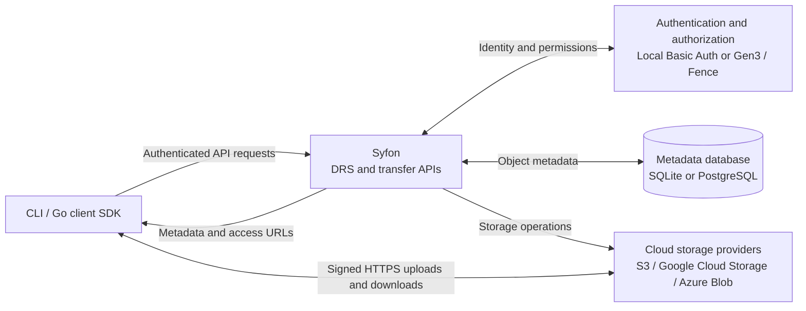

<div align="center">
  
  <br><br>
  <a href="https://pkg.go.dev/github.com/calypr/syfon/client"></a>
  <a href="https://calypr.org/syfon/"></a>
  <a href="https://github.com/calypr/syfon/actions/workflows/ci.yaml"></a>
  <a href="https://app.codecov.io/gh/calypr/syfon/tree/development"></a>
  <a href="https://app.codecov.io/gh/calypr/syfon/tree/development"></a>
  <a href="LICENSE"></a>
  <a href="CONTRIBUTING.md"></a>
  <a href="https://github.com/calypr/syfon/releases"></a>
</div>

# Syfon

Syfon is a [GA4GH Data Repository Service (DRS)](https://ga4gh.github.io/data-repository-service-schemas/) in Go for indexing, authorizing access to, and transferring data across object stores, with a CLI and Go client SDK.

**[Quick Start](docs/quickstart.md) · [Documentation](https://calypr.org/syfon/) · [Go Client SDK](https://pkg.go.dev/github.com/calypr/syfon/client) · [Releases](https://github.com/calypr/syfon/releases)**

| Capability | Support |
| --- | --- |
| Metadata and discovery | GA4GH DRS object records and access methods, plus scoped indexing and listing |
| Storage | S3 and S3-compatible services, Google Cloud Storage, Azure Blob Storage, and local files |
| Transfers | Short-lived cloud access URLs, multipart uploads, and ranged downloads |
| Authentication | Local Basic Auth or Gen3 bearer tokens with scoped authorization |
| Metadata database | SQLite for local deployments; PostgreSQL for Gen3 deployments |
| Clients | Command-line tools and a [Go SDK](client) for uploads, downloads, and metadata operations |

## Architecture

Syfon checks access, manages object metadata, and coordinates storage operations. For cloud transfers, it returns short-lived signed URLs so the client can upload or download directly from the storage provider.



Cloud credentials stay on the server. The local file provider returns filesystem paths and requires the client to have access to the same files.

## Install

Install the published command with:

```bash
curl -sSL https://calypr.org/syfon/install.sh | bash
```

To build from a checkout:

```bash
make build
bin/syfon version
```

The build writes `bin/syfon`. An installed binary is named `syfon`.

## Run locally

Create `local.yaml` with a SQLite database, local Basic Auth, and one S3-compatible bucket:

```yaml
port: 8080

auth:
  mode: local
  basic:
    username: drs-user
    password: drs-pass

database:
  sqlite:
    file: ./data/drs.db

credential_encryption:
  local_key_file: ./data/.syfon-credential-kek

buckets:
  - bucket: local-bucket
    provider: s3
    region: us-east-1
    endpoint: http://localhost:9000
    access_key: minio-user
    secret_key: minio-pass
```

Start the server after starting an S3-compatible endpoint such as MinIO:

```bash
bin/syfon serve --config local.yaml
```

For a complete MinIO startup and bucket-creation sequence, follow the [Quick Start](docs/quickstart.md).

Check that it is ready:

```bash
curl -u drs-user:drs-pass http://localhost:8080/healthz
```

Use `auth.mode: local` with SQLite for local work. Use `auth.mode: gen3` with PostgreSQL for a Gen3 deployment. The [configuration reference](docs/configuration.md) lists every field, default, and environment override.

## Use the CLI

The CLI talks to `http://127.0.0.1:8080` by default. Set `SYFON_SERVER_URL` or pass `--server` to choose another server. Set `SYFON_USERNAME` and `SYFON_PASSWORD` for local Basic Auth, or set `SYFON_TOKEN` or `SYFON_PROFILE` for a Gen3 server.

```bash
syfon ping
syfon upload --file ./README.md --org example --project example
syfon ls --organization example --project example
syfon download --did <did> --out /tmp/README.md
```

The CLI also includes bucket, record, project-copy, validation, and transfer-metrics operations. Run `syfon --help` or `syfon <command> --help` for the current flags.

## HTTP API

With the docs route enabled, Syfon serves Swagger UI at `/index/swagger` and the bundled OpenAPI document at `/index/openapi.yaml`. The GA4GH DRS routes are under `/ga4gh/drs/v1/`. Internal upload, indexing, bucket, and multipart routes are under `/data` and `/index`.

## Develop

Initialize the GA4GH schema submodule and run the main checks with:

```bash
git submodule update --init --recursive
make test
make docs
```

The schema checkout lives at `data-repository-service-schemas`. Run `make gen` after changing that schema, a local OpenAPI input, or a code-generation config. Do not edit generated files under `apigen` by hand.

Read the [Quick Start](docs/quickstart.md), [local deployment guide](docs/local-deployment.md), [configuration reference](docs/configuration.md), [plugin guide](docs/plugins.md), and [contributor guide](CONTRIBUTING.md) for the supported workflows.

## License

Syfon is licensed under the MIT License. See [LICENSE](LICENSE).
