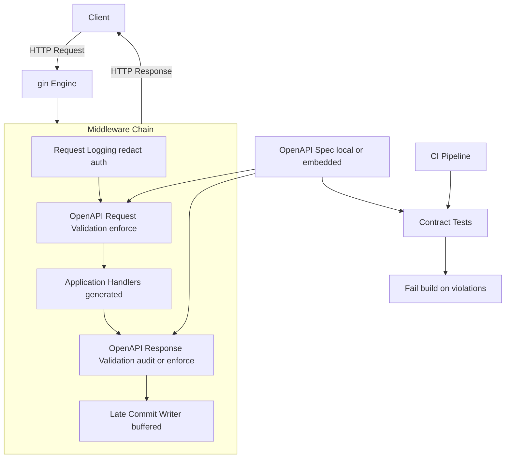

# ADR-0001: OpenAPI Request and Response Validation in Gin

## Status

Accepted

## Date

2025-12-22

## Context

The DRS server is implemented in Go (Gin) with server scaffolding generated from OpenAPI. Contract correctness matters for interoperability and operational safety. The OpenAPI spec includes deep schemas and recursive references (e.g., `DrsObject → ContentsObject → DrsObject`), making “generator-only correctness” insufficient.

We need:

* Strong request/response contract guarantees
* Clear operational visibility into contract drift
* A safe rollout path (audit-first in prod)
* CI enforcement to prevent regressions

## Decision

Implement OpenAPI validation middleware using **kin-openapi** (`openapi3filter`) as the validation engine.

* **Request validation**: enforce at runtime by default (reject invalid requests)
* **Response validation**: buffering + late-commit middleware with two modes:

    * **Audit mode** (default in production): log/metrics on violations, allow response
    * **Enforce mode** (CI / pre-prod): block invalid responses (fail closed with 500)

Black-box contract testing complements runtime validation in CI.

## Mermaid diagram



## Configuration and feature gating

### Should validation be configurable?

Yes—**validation must be configurable**, but with guardrails.

Reasons:

* Response validation has real operational tradeoffs (buffering, streaming endpoints, large payloads)
* Production rollout should support “audit-first” to avoid outages
* Different environments need different strictness (dev vs CI vs prod)
* Some endpoints may need opt-out (SSE, downloads, websocket/hijack)

### Recommended configuration shape

A single config block controlling both request and response validation:

* `validation.enabled` (master switch)
* `validation.request.mode` = `off | enforce`
* `validation.response.mode` = `off | audit | enforce`
* `validation.response.maxBodyBytes`
* `validation.response.skipContentTypes` (e.g., `text/event-stream`)
* `validation.excludeRoutes` (optional allowlist/denylist)

Example (YAML):

```yaml
validation:
  enabled: true
  request:
    mode: enforce
  response:
    mode: audit        # audit in prod, enforce in CI
    maxBodyBytes: 2097152
    skipContentTypes:
      - text/event-stream
      - application/octet-stream
```

Environment mapping:

* **CI**: request=enforce, response=enforce
* **Dev**: request=enforce, response=audit (or enforce)
* **Prod**: request=enforce, response=audit

### Guardrails (what *not* to do)

* Do not ship prod with validation silently disabled by default.
* Do not make “off” the default for request validation unless you have strong external gateways that already validate.
* Do not enforce response validation on endpoints that stream or return huge bodies without explicit handling.

### Suggested default behavior

* Default `validation.enabled=true`
* Default `request.mode=enforce`
* Default `response.mode=audit`
* Default `maxBodyBytes=2MiB`
* Default `skipContentTypes` includes SSE and known streaming types

## Alternatives Considered

1. Generator-only validation: rejected (does not validate runtime behavior; fragile with recursion)
2. Fully dereferenced spec + codegen: rejected (can explode recursion and break generators)
3. CI-only contract testing: insufficient alone (doesn’t protect runtime deployments)

## Consequences

### Positive

* Strong contract guarantees with realistic deployment posture
* Audit-first rollout for response validation
* CI enforcement prevents regressions
* Metrics/logs provide contract drift visibility

### Negative

* Response validation requires buffering and careful exclusions
* Some endpoints must be skipped or handled specially (streaming/hijack)
* Adds some latency and memory overhead proportional to buffered bodies

## References

* kin-openapi: [https://github.com/getkin/kin-openapi](https://github.com/getkin/kin-openapi)
  openapi3filter docs: [https://pkg.go.dev/github.com/getkin/kin-openapi/openapi3filter](https://pkg.go.dev/github.com/getkin/kin-openapi/openapi3filter)
* oapi-codegen middleware patterns (net/http): [https://github.com/oapi-codegen/oapi-codegen/tree/main/pkg/middleware/nethttp](https://github.com/oapi-codegen/oapi-codegen/tree/main/pkg/middleware/nethttp)
* Dredd: [https://dredd.org/en/latest/](https://dredd.org/en/latest/)
* Schemathesis: [https://schemathesis.readthedocs.io/](https://schemathesis.readthedocs.io/)
* Background reading:

    * [https://medium.com/@tamas.szabo/validating-openapi-requests-and-responses-in-go-3e2b1c7e5a73](https://medium.com/@tamas.szabo/validating-openapi-requests-and-responses-in-go-3e2b1c7e5a73)
    * [https://apisyouwonthate.com/blog/api-contract-testing-vs-runtime-validation/](https://apisyouwonthate.com/blog/api-contract-testing-vs-runtime-validation/)

## Implementation

NewOpenAPIResponseValidator **doesn’t** load the YAML itself.

`NewOpenAPIResponseValidator` validates against the **OpenAPI spec object that was already loaded by the request validator**, indirectly, via the **matched route** stored in Gin’s context.

### The flow

1. **Request validator loads the YAML** at startup:

    * `loader.LoadFromFile(specPath)` → `*openapi3.T`
2. It builds an OpenAPI router from that spec:

    * `gorillamux.NewRouter(spec)`
3. For each request, it finds the matching OpenAPI operation:

    * `route, pathParams := r.FindRoute(req)`
4. It **stores that route** on the Gin context:

    * `c.Set("oapi.route", route)`
    * `c.Set("oapi.pathParams", pathParams)`
5. **Response validator reads those values**:

    * `route := c.MustGet("oapi.route").(routers.Route)`
    * `pathParams := c.MustGet("oapi.pathParams").(map[string]string)`
6. Then it calls:

    * `openapi3filter.ValidateResponse(ctx, ResponseValidationInput{ Route: route, ... })`

That `route` object contains the operation metadata tied to the spec that was loaded in step 1, so the response validator is effectively validating against the same loaded spec—without reloading YAML.

### What you need to ensure

* The **request validator middleware must run before** the response validator middleware.
* The request validator must **store `oapi.route` and `oapi.pathParams`**.

### If you want response validation without request validation

You’d need to have the response validator:

* load the spec itself, and/or
* match the route again (`FindRoute`) using its own OpenAPI router.

But in practice, sharing the matched route from request validation is the cleanest and fastest approach.


## Follow-up Actions

* Add Prometheus counters for request/response violations
* Add CI job that runs response validation in enforce mode
* Document excluded endpoints (streaming, downloads) and why
* Add dashboards for validation failures by route/status
