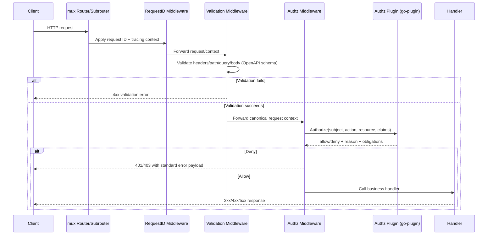

# ADR: Move Validation and Authorization to Middleware with Pluggable Authorization

## Status
Proposed

## Date
2026-04-14

## Decision owners
Syfon maintainers

## Context
Validation and authorization checks are currently split between middleware and individual handlers/services. This causes:

- Inconsistent enforcement across endpoints.
- Duplicate logic in route handlers.
- Uneven error formats and status-code behavior.
- Harder auditing and security review because checks are scattered.

The project already contains middleware building blocks (`internal/api/middleware`), but authorization policy decisions are still tightly coupled to server code paths rather than provided as a pluggable middleware concern.

## Decision
1. Standardize request validation and authorization as middleware-first concerns for all API surfaces.
2. Introduce a Go plugin manager for authorization middleware extensibility.
3. Use **HashiCorp go-plugin** as the plugin manager.
4. Define and load an **Authorization Decision plugin** that runs in middleware and returns allow/deny decisions plus optional policy context.

## Selected plugin manager
Because no dedicated Go plugin manager was previously included, this ADR selects and includes:

- `github.com/hashicorp/go-plugin`

Why this manager:

- Mature ecosystem support for plugin lifecycles.
- Process isolation for safer execution than in-process dynamic loading.
- Supports versioned interfaces and handshake protocols.
- Works well with strict authorization boundaries (plugin can be restarted/rotated independently).

## Middleware model
Request flow (high level):

1. **Request ID / tracing middleware**
2. **Input normalization middleware**
3. **Validation middleware**
   - Required headers, token presence, path/query/body schema checks.
4. **Authorization middleware (plugin-backed)**
   - Builds authorization input from route, method, caller identity, scopes, and resource hints.
   - Calls the authorization plugin through go-plugin.
   - Enforces deny/allow and emits consistent audit metadata.
5. **Business handler** (assumes validated + authorized request context)

### Authz plugin sequence diagram

## Current usage of `internal/api/middleware`
Today the server already applies middleware on the protected API subrouter (`api := router.PathPrefix("/").Subrouter()`), while keeping `/healthz` public and bypassing middleware for readiness checks. The two middleware currently wired are request ID and authz middleware, in this order:

1. `requestIDMiddleware.Middleware`
2. `authzMiddleware.Middleware`

This means all non-health routes pass through these two middleware before route handlers execute. The current authz middleware performs basic/gen3 header handling and privilege hydration, but full policy decision logic is still distributed across downstream service/DB checks; this ADR proposes consolidating that into middleware as the single decision point.

## Gap analysis: current vs target validation/authz architecture
The following analysis identifies where validation and authorization happen now and what must change.

| Area | Current state | Gap | Required change |
|---|---|---|---|
| Route entry middleware | Request ID + authz middleware are wired on protected subrouter. | No centralized schema-validation middleware on the runtime server path. | Add OpenAPI request validation middleware in the standard chain before authz. |
| Request validation ownership | Validation is partly handler/service specific and not uniformly enforced for every endpoint. | Inconsistent checks and error shapes across routes. | Move request-shape validation (headers/path/query/body) into shared middleware and standardize error payloads. |
| Authorization decision point | Authz middleware currently hydrates auth context (basic/gen3, privilege lookup/caching), while downstream service/DB layers still enforce many allow/deny decisions. | Authorization logic is split across layers, reducing consistency and audit clarity. | Promote middleware to the primary allow/deny decision point; convert downstream checks to defense-in-depth assertions where needed. |
| Policy extensibility | Authorization behavior is server-coupled and not expressed through a stable plugin contract. | Harder to evolve/replace policy implementation without code-level changes in core server. | Introduce go-plugin-backed authorization interface with versioned request/response contract. |
| Failure behavior | Mixed behavior based on route and layer; auth failures can be surfaced differently depending on where checks run. | Non-uniform operational semantics during transient failures. | Define fail-closed semantics for protected routes in middleware with explicit exemptions for health/readiness routes only. |
| Audit and observability | Logs/decisions can be emitted from multiple locations, complicating end-to-end policy tracing. | Difficult to reconstruct a single canonical authz decision path per request. | Emit canonical authz decision/audit events in middleware and add dedicated metrics (`authz_allow`, `authz_deny`, `authz_error`). |
| Spec conformance guardrails | OpenAPI docs exist and validator patterns exist in tooling code, but not as default runtime request gate for server handlers. | Runtime request acceptance can drift from OpenAPI contract. | Make OpenAPI validation middleware a first-class runtime gate and enforce conformance before authz/handlers. |

Migration impact:

- Handlers should stop performing duplicate structural validation once middleware coverage is complete.
- Service/DB authorization checks should be reviewed and categorized as:
  - policy decisions to move to middleware, or
  - invariant/business-integrity checks to keep as defense-in-depth.
- Conformance tests should assert middleware order and ensure deny/validation behaviors are consistent across all protected endpoints.

## Authorization plugin contract (middleware layer)
The middleware-to-plugin contract should include:

- Input:
  - `request_id`
  - `subject` (user/service principal)
  - `action` (HTTP method + logical operation)
  - `resource` (object/bucket/path/program)
  - `claims/scopes`
  - optional request metadata
- Output:
  - `allow` (bool)
  - `reason` (short machine-readable code)
  - optional `obligations/context` for downstream logging

Default behavior:

- Plugin unavailable => fail closed for protected endpoints.
- Health/readiness endpoints can remain explicitly exempted via route policy config.

## OpenAPI schema-based request validation in middleware
The middleware layer should enforce schema-level request validation before authorization and business logic. The project already has precedent for this approach in `cmd/validate/openapi_validator.go`, which uses:

- `kin-openapi` (`openapi3`, `openapi3filter`)
- router lookup (`routers/gorillamux`)
- request validation (`ValidateRequest`)

Proposed server middleware behavior for schema validation:

1. Load and validate OpenAPI document(s) at startup.
2. Resolve each incoming request to an OpenAPI operation.
3. Validate path params, query params, headers, and body payload against schema.
4. On validation failure, return a standardized `400` response (or `404` for unknown routes in strict mode).
5. Only after successful schema validation should authz middleware invoke the plugin.

Recommended ordering:

1. Request ID middleware
2. OpenAPI validation middleware
3. Plugin-backed authorization middleware
4. Handler

This creates a deterministic contract: handlers only receive requests that are both schema-valid and authorized.

## Consequences
### Positive
- Consistent security controls for every route.
- Cleaner handlers (business logic only).
- Easier policy evolution by swapping/updating authz plugin implementation.
- Better auditability via single middleware decision point.

### Negative / tradeoffs
- Added operational complexity (plugin process lifecycle).
- Startup/readiness requires plugin health checks.
- Slight latency overhead for middleware authorization calls.

## Implementation plan
1. Add central middleware chain builder per router.
2. Move handler-local validation into shared validation middleware.
3. Introduce plugin client manager using HashiCorp go-plugin.
4. Define authorization plugin interface + versioning.
5. Add middleware adapter that calls plugin and writes standardized deny responses.
6. Add route policy map for endpoints exempt from authz.
7. Add metrics (`authz_allow`, `authz_deny`, `authz_error`) and structured audit logs.

## Guardrails
- Fail-closed for protected routes.
- Interface version pinning and explicit handshake checks.
- Timeouts/circuit-breaker behavior in middleware to avoid request hangs.
- No handler should implement independent authz logic once migration is complete.

## Rollout strategy
- Phase 1: Introduce middleware + plugin behind feature flag.
- Phase 2: Migrate high-risk write endpoints first.
- Phase 3: Migrate remaining read endpoints.
- Phase 4: Remove legacy in-handler validation/authz paths.

## Success criteria
- 100% protected endpoints use middleware authorization checks.
- Validation logic is not duplicated in handlers.
- Authorization outcomes are observable in metrics and audit logs.
- Route-level conformance tests verify middleware enforcement.
