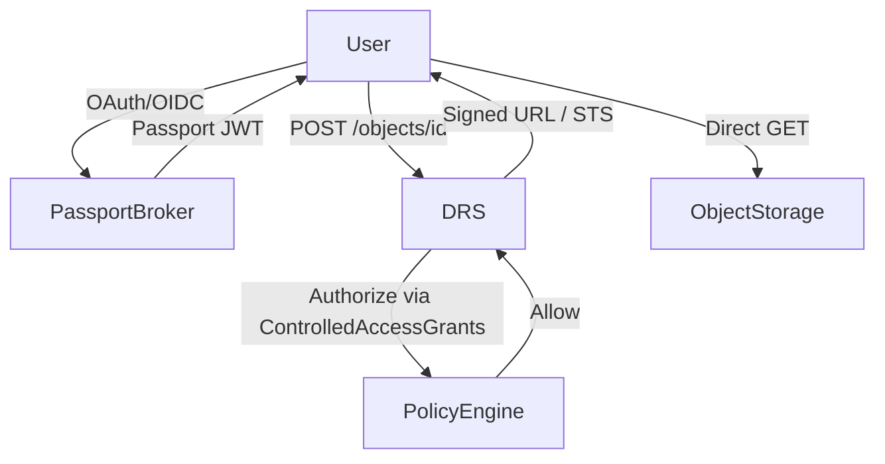
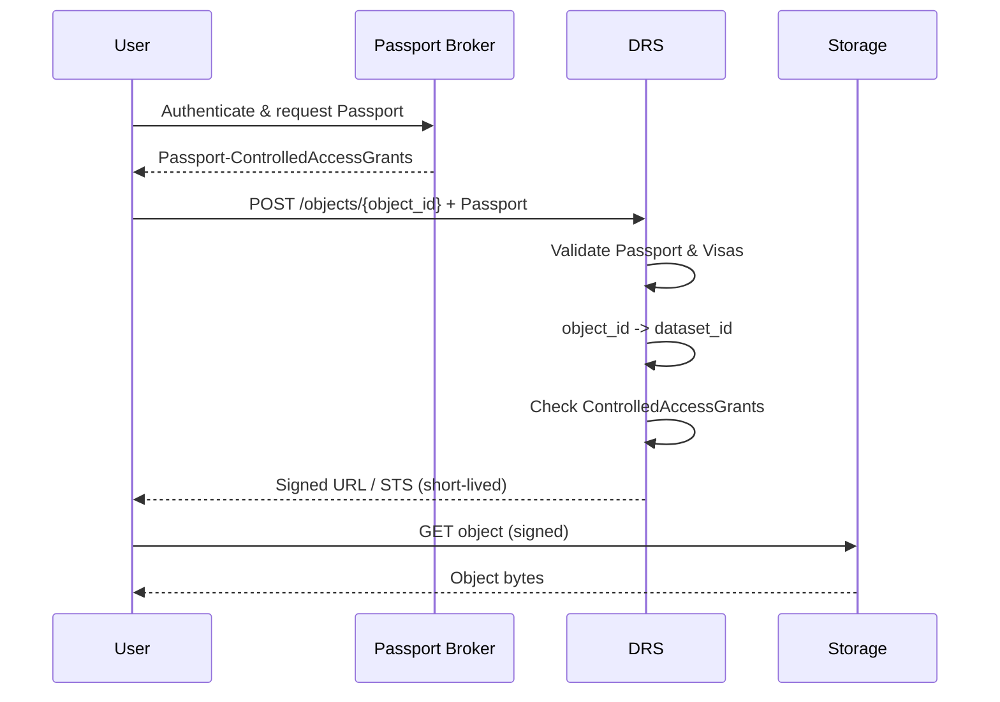

# ADR-002: GA4GH Passports, DRS Authorization, ControlledAccessGrants, and Signed Access

## Status
For discussion

## Context

This ADR documents the interaction between **GA4GH Passports**, **Data Repository Service (DRS)**,
**ControlledAccessGrants**, and **signed URLs / short-lived credentials (STS)**.

The goal is to clearly separate:
- Authentication
- Authorization
- Data-plane access

while remaining compliant with GA4GH standards and scalable for large controlled-access datasets.

---

## Key Concepts

### Passports
GA4GH Passports are JWT bundles containing Visas. They represent **who the user is** and
**what they are authorized to access**.

Identity is defined by:
- `iss` (issuer)
- `sub` (subject)

### ControlledAccessGrants
A `ControlledAccessGrants` Visa represents an affirmative authorization decision issued by a DAC.
It authorizes access to a **protected dataset**, not individual files.

The Visa `value` is the **dataset identifier** and must exactly match the identifier used by DRS policy.

### DRS Objects
DRS exposes immutable objects identified by `object_id`.
Each protected object must be mapped internally to a dataset identifier.

### Signed URLs / STS
Signed URLs or short-lived credentials provide **temporary data-plane access** to object storage.
They are:
- Time-limited
- Object-scoped
- Identity-agnostic

---

## Decision

1. **Authorization is enforced at the DRS layer using Passports**
2. **ControlledAccessGrants are evaluated at dataset level**
3. **DRS mints short-lived credentials only after successful authorization**
4. **Object storage never evaluates Passport or identity claims**

---

## Architecture Diagram



---

## Sequence Diagram



---

## Authorization Logic

Authorization succeeds if:
- Passport contains a valid `ControlledAccessGrants` Visa
- `visa.value == dataset_id`
- `visa.iss` is trusted
- `visa.exp` is not expired

Failure returns `403 Forbidden`.

---

## Interaction with Signed URLs / STS

- Signed URLs are minted **only after authorization**
- Lifetime must be **shorter than Visa lifetime**
- URLs are **read-only** and **object-scoped**
- Revocation occurs by:
    - Visa expiration
    - DRS refusal to mint new credentials

---

## Consequences

### Positive
- Clear separation of governance and storage
- Scales to large datasets
- Minimizes trust surface of object storage

### Negative
- Signed URLs cannot be revoked mid-lifetime
- Requires strict lifetime management

---

## Invariants

- Passport authorizes *whether*
- DRS authorizes *what*
- Signed URLs authorize *how long*

---

## Alternatives Considered

- Passing Passport to storage (rejected)
- Dataset-wide storage credentials (rejected)
- Long-lived signed URLs (rejected)

---

## References

- GA4GH Passports Specification
- GA4GH DRS Specification
- GA4GH ControlledAccessGrants Visa Profile

---

Below is a practical “wiring diagram” of how **GA4GH Passports** relate to **DRS**, what data “keys” they share, and how **authorization of DRS objects** typically works.

## 1) What depends on what

### Passports (AAI layer) → used by DRS (data access layer)

* **GA4GH Passports** define how to represent a researcher’s identity + permissions as **Visas** (signed JWTs) bundled into a **Passport claim** (`ga4gh_passport_v1`). ([GA4GH][1])
* **DRS** is a *read-only* object access API that can *optionally* use Passports (or bearer/basic tokens) to authorize calls. ([GA4GH][2])

### Passport Broker/UI are *issuers/aggregators*, not “DRS features”

* DRS docs explicitly note it’s **not DRS’s job to return a Passport**; issuing/aggregating Passports is the broker’s responsibility. ([GA4GH][2])
* Starter Kit Passport UI/Broker exist to help users obtain a Passport JWT (and the UI is built to work with other passport microservices). ([GA4GH Starter Kit][3])
* Starter Kit DRS explicitly calls out **“Passport mediated auth to DRS objects”** and an **“Auth info”** feature to discover brokers/visas for controlled-access objects. ([GitHub][4])

## 2) Where the “join points” are (primary keys / identifiers)

There isn’t one single universal primary key shared by both specs; instead you typically join across three axes:

### A) **User identity key** (Passport-side)

* A Visa’s user identity is the pair **{`sub`, `iss`}** (“Visa Identity”). ([GA4GH][1])

  * `iss` = issuer (OIDC / Visa Issuer / Broker depending on flow)
  * `sub` = subject identifier within that issuer

This is what your DRS authorization layer ultimately answers: *“does the user represented by (`iss`,`sub`) have the right visas?”*

### B) **Object key** (DRS-side)

* The “thing being protected” is the **DRS object id** (`object_id`, `drs_object_id`) used in:

  * `GET /objects/{object_id}`
  * `POST /objects/{object_id}` (Passport-bearing)
  * `GET /objects/{object_id}/access/{access_id}` (and Passport-bearing variants) ([GA4GH][2])

### C) **Issuer discovery key** (DRS ↔ Passport trust alignment)

DRS exposes *which auth modes and issuers apply* via OPTIONS “auth discovery”:

* `OPTIONS /objects/{object_id}` returns an `Authorizations` structure including:

  * `supported_types` (e.g., None/Basic/Bearer/Passport)
  * `passport_auth_issuers`
  * `bearer_auth_issuers` ([GA4GH][2])

This is a key interoperability point: the issuer strings in `passport_auth_issuers` must align with what your Passport clearinghouse layer trusts/accepts (typically Visa `iss`, and/or broker/issuer metadata).

## 3) How DRS “knows” Passport is required (and how clients discover it)

DRS supports multiple auth modes, and they can vary per object. The spec recommends indicating required auth via the **OptionsObject** API and via access methods. ([GA4GH][2])

Concretely:

* `GET /objects/{object_id}` may allow `None`, `BasicAuth`, or `BearerAuth` (depending on the object and server policy). ([GA4GH][2])
* If Passport is required/allowed, the pattern is:

  * client calls `OPTIONS /objects/{object_id}` → sees `supported_types` and `passport_auth_issuers`
  * client then calls `POST /objects/{object_id}` and includes Passport token(s) in the request body (PassportAuth is defined that way). ([GA4GH][2])

## 4) How “authorization of DRS objects” usually works with Visas

Think of DRS as the enforcement point, with Passport acting as the portable “proof”:

1. **DRS object has a policy** (out of band / implementation-defined)

  * Example: object X requires a **ControlledAccessGrants** visa whose `value` points at dataset/resource Y, and issuer must be trusted.

2. Client obtains Passport (UI/Broker flow) containing Visa JWT(s)

  * Passports carry `ga4gh_passport_v1` with embedded visas. ([GA4GH][1])

3. Client calls DRS using Passport-bearing endpoints

  * PassportAuth is explicitly modeled as a POST-body token mechanism in DRS. ([GA4GH][2])

4. DRS acts as (or delegates to) a **Passport Clearinghouse**

  * It validates Visa signatures/expiry/trust chain per GA4GH AAI/Passport rules, then evaluates Visa content.
  * Visas include required JWT claims (`iss`, `sub`, `iat`, `exp`) and a structured `ga4gh_visa_v1` object (`type`, `asserted`, `value`, `source`, etc.). ([GA4GH][1])

5. DRS matches visas to its object policy

  * For dataset/object entitlements, the standard Visa type **ControlledAccessGrants** encodes “access granted” and its `value` is a URL identifying the dataset/object being granted. ([GA4GH][1])
  * The spec also notes how `value` must be matched/validated (case-sensitive full match unless the Visa type defines safe partitioning). ([GA4GH][1])

### Key takeaway

**Authorization is fundamentally:**

* `DRS object_id` → mapped (by your DRS implementation) to required Visa types/values/issuers
* `Passport` → proves the caller’s (`iss`,`sub`) and includes Visa assertions
* `OPTIONS /objects/{id}` → tells clients what to present (and from which issuers) ([GA4GH][2])

## 5) Minimal dependency map you can drop into docs

* **Passport UI/Broker**: obtains Passport JWT(s) with visa claims (`ga4gh_passport_v1`). ([GitHub][5])
* **DRS**: protects `DrsObject`s; may require Bearer/Basic headers or Passport POST depending on object; exposes auth discovery via OPTIONS. ([GA4GH][2])
* **Shared “keys”**:

  * user: `{sub, iss}` (Visa Identity) ([GA4GH][1])
  * object: `object_id` / `drs_object_id` ([GA4GH][2])
  * trust: DRS `passport_auth_issuers` ↔ Visa/issuer/broker trust configuration ([GA4GH][2])

## 6) Useful links

[1]: https://ga4gh.github.io/data-security/ga4gh-passport "GA4GH Passport | GA4GH Data Security"
[2]: https://ga4gh.github.io/data-repository-service-schemas/preview/develop/docs/ "Data Repository Service"
[3]: https://starterkit.ga4gh.org/docs/starter-kit-apis/passport/passport_ui_overview?utm_source=chatgpt.com "Starter Kit Passport UI Overview"
[4]: https://github.com/ga4gh/ga4gh-starter-kit-drs "GitHub - ga4gh/ga4gh-starter-kit-drs: Open, extensible server implementation of the GA4GH Data Repository Service (DRS) specification"
[5]: https://github.com/ga4gh/ga4gh-starter-kit-passport-ui "GitHub - ga4gh/ga4gh-starter-kit-passport-ui: Central UI server connecting to other Passport-related microservices (ory hydra, ory kratos)"

---

## Deep Dive

Below is a **deep dive on `ControlledAccessGrants`** and how it is *actually* used to authorize access to **DRS objects that belong to a protected dataset**, written from an implementer’s point of view (DRS + Passport + policy engine).

---

## 1. What `ControlledAccessGrants` is (and is not)

**`ControlledAccessGrants` is a *Visa type*** defined by **GA4GH Passports**.

It represents **an affirmative authorization decision**:

> *“The bearer is allowed to access a specific controlled-access resource.”*

Key clarifications:

* It **does not identify the user** → identity comes from `iss + sub`
* It **does not authenticate the request** → OAuth / OIDC / Bearer token does that
* It **does not describe the data object directly** → it references a *policy resource* (usually a dataset)

It is a **portable entitlement**, not an ACL.

---

## 2. Canonical structure of a `ControlledAccessGrants` Visa

At minimum (simplified):

```json
{
  "iss": "https://dac.example.org",
  "sub": "user-123",
  "iat": 1710000000,
  "exp": 1712600000,
  "ga4gh_visa_v1": {
    "type": "ControlledAccessGrants",
    "asserted": 1709999000,
    "value": "https://datasets.example.org/datasets/DS-001",
    "source": "https://dac.example.org"
  }
}
```

### Semantics of the important fields

| Field    | Meaning                                                          |
| -------- | ---------------------------------------------------------------- |
| `type`   | Must be exactly `ControlledAccessGrants`                         |
| `value`  | **The protected resource identifier** (most often a dataset URL) |
| `iss`    | Who issued the grant (DAC / authorization authority)             |
| `sub`    | Who the grant applies to                                         |
| `exp`    | When the authorization expires                                   |
| `source` | Human/traceable provenance (often same as `iss`)                 |

> 🔑 **The `value` is the join key between Passport and DRS policy.**

---

## 3. The critical design choice: *dataset-level* grants, not object-level

In practice, **`ControlledAccessGrants` almost always point to a dataset**, not to individual files or DRS object IDs.

Why?

* Datasets are **stable, reviewable, governance-level entities**
* Files come and go (reprocessing, new versions, re-partitioning)
* DAC approvals are granted **for a dataset under a use agreement**

So you get this hierarchy:

```
Dataset (protected, DAC-approved)
 ├── DRS Object A (bam)
 ├── DRS Object B (vcf)
 ├── DRS Object C (index)
 └── DRS Object D (metadata)
```

**One Visa → many DRS objects**

---

## 4. How a DRS server uses `ControlledAccessGrants`

### Step 1: DRS object is mapped to a dataset

This mapping is **implementation-defined**, but must exist.

Common patterns:

* DRS object metadata includes `dataset_id`
* Indexd / metadata store has `dataset` or `program/project` tags
* Object URL structure encodes dataset identity

Example internal model:

```yaml
drs_object_id: drs://repo/abc123
dataset_id: https://datasets.example.org/datasets/DS-001
```

---

### Step 2: Client discovers auth requirements

Client calls:

```
OPTIONS /objects/{object_id}
```

DRS responds with something like:

```json
{
  "supported_types": ["PassportAuth"],
  "passport_auth_issuers": [
    "https://dac.example.org"
  ]
}
```

This tells the client:

* Passport is required
* Visas must be issued by this DAC

---

### Step 3: Client presents Passport

Client calls:

```
POST /objects/{object_id}
```

with:

```json
{
  "passport": [
    "<base64url-encoded Visa JWT>",
    "<optional additional visas>"
  ]
}
```

---

### Step 4: DRS validates the Visa (Clearinghouse role)

DRS (or a delegated clearinghouse) must:

1. Verify JWT signature
2. Verify `exp`, `nbf`, `iat`
3. Verify `iss` is trusted
4. Extract `type`, `value`, `sub`

This is **pure Passport validation** — no dataset logic yet.

---

### Step 5: Authorization decision (this is the key part)

For the requested DRS object:

```text
Required dataset = DS-001
```

DRS checks:

> Does the Passport contain **at least one** valid
> `ControlledAccessGrants` Visa where:
>
> * `visa.type == "ControlledAccessGrants"`
> * `visa.value == dataset_id`
> * `visa.iss` is trusted
> * `visa.exp` is valid

If **yes** → access allowed
If **no** → `403 Forbidden`

---

## 5. Why the `value` must be an exact, stable identifier

The Passport spec is very explicit:

* `value` matching is **exact string match**
* No globbing
* No prefix matching
* No implied hierarchy (unless the Visa type explicitly defines it)

So **this is a contract**:

> Whatever string your DAC puts in `value`
> must be exactly what your DRS policy engine checks.

That’s why most deployments choose:

* A **dataset URL**
* Or a **stable dataset UUID URL**

Example good choices:

```
https://datasets.example.org/datasets/DS-001
urn:uuid:3f1b8d2e-...
```

Bad choices:

```
/projects/foo
dataset-1
"controlled"
```

---

## 6. Multiple datasets, multiple grants

A Passport can (and often does) contain **multiple ControlledAccessGrants**:

```text
User has access to:
- DS-001
- DS-017
- DS-042
```

DRS authorization is then:

```
object.dataset_id ∈ { visa.value }
```

No per-object logic required.

---

## 7. What `ControlledAccessGrants` deliberately avoids

This is by design:

❌ It does *not* encode:

* File paths
* DRS object IDs
* Bucket names
* Access methods (S3 vs HTTPS)
* Read vs write (DRS is read-only)

Those remain **local enforcement details**.

---

## 8. Mental model summary (one paragraph)

> **`ControlledAccessGrants` is the bridge between governance and storage.**
> A DAC issues a Visa saying “this person may access dataset X.”
> A DRS server maps each protected object to dataset X and enforces that rule by requiring a Passport containing a matching Visa before returning object metadata or access URLs.

---

This is the part that usually causes confusion, so let’s be very explicit and concrete.

**TL;DR**
`ControlledAccessGrants` authorize *whether* a user may access a protected dataset.
**Signed URLs / short-lived credentials control *how* that access is temporarily exercised.**
They are complementary and intentionally decoupled.

---

## 1. Separation of concerns (the core principle)

Think in **three layers**, each with a different trust boundary and lifetime:

| Layer                                 | Responsibility                              | Lifetime          |
| ------------------------------------- | ------------------------------------------- | ----------------- |
| **Passport / ControlledAccessGrants** | *Authorization decision* (is user allowed?) | Hours → months    |
| **DRS server**                        | *Policy enforcement & mediation*            | Request-scoped    |
| **Signed URL / temp creds**           | *Data plane access*                         | Seconds → minutes |

**Passports never grant direct storage access.**
They only allow the DRS server to *mint* temporary access.

---

## 2. End-to-end flow with signed URLs

### Step 1: User authenticates and presents Passport

* Client authenticates with OAuth/OIDC
* Client includes Passport (with `ControlledAccessGrants`) when calling DRS

```
POST /objects/{object_id}
```

DRS verifies:

* Passport signature
* Trusted issuer
* `ControlledAccessGrants.value == dataset_id`
* Visa is unexpired

👉 **Authorization happens here and only here**

---

### Step 2: DRS authorizes the object

DRS maps:

```
object_id → dataset_id
```

Checks:

```
dataset_id ∈ ControlledAccessGrants.value
```

If authorized → proceed
If not → `403 Forbidden`

---

### Step 3: DRS mints *ephemeral* access

Only **after authorization succeeds**, DRS generates one of:

* A **pre-signed URL** (S3, GCS, Azure)
* A **short-lived access token**
* Temporary cloud credentials (STS-style)

Examples:

* S3 presigned GET (5–15 minutes)
* GCS signed URL
* Azure SAS token

These credentials:

* Are **scoped to a single object**
* Are **time-limited**
* Are **not reusable across objects**
* Are **not tied to user identity**

---

### Step 4: Client accesses storage directly

Client downloads from object storage **without Passport**, **without OAuth**, **without identity**:

```
GET https://bucket.s3.amazonaws.com/object?...signature...
```

At this point:

* Storage layer has **no idea who the user is**
* Storage only verifies cryptographic validity + expiry

This is intentional.

---

## 3. Why Passport is *not* used at the storage layer

### Security reasons

* Object stores don’t understand GA4GH Passports
* JWT validation inside storage is infeasible
* Storage credentials must be revocable by time, not identity

### Scalability reasons

* Avoid per-request auth checks on multi-GB downloads
* Avoid holding auth state open for hours
* CDN compatibility

### Governance reasons

* Access review happens *before* access is granted
* Download is treated as execution of an already-approved decision

---

## 4. Key invariants you must maintain

### Invariant 1: **Signed URLs must never outlive authorization intent**

Best practice:

```
Visa lifetime  >>  signed URL lifetime
```

Example:

* Visa valid for 7 days
* Signed URL valid for 5 minutes

Never reverse this.

---

### Invariant 2: **Signed URLs must be non-escalating**

A signed URL:

* Must only allow **read**
* Must only allow **that object**
* Must not allow listing, overwrite, or delete

If your URL allows more than what DRS authorized → that’s a bug.

---

### Invariant 3: **DRS is the only mint**

Clients must **never**:

* Exchange Passport directly for cloud creds
* Reuse creds across objects
* Cache creds beyond expiry

All minting goes through DRS.

---

## 5. How revocation actually works (important)

You **cannot revoke a signed URL once issued**.

So revocation happens at **two earlier points**:

1. **Visa expiry**

  * DAC revokes access by shortening Visa lifetime or not reissuing
2. **DRS mint refusal**

  * After revocation, new signed URLs cannot be minted

This is why short lifetimes matter.

---

## 6. Multiple objects, same dataset

This is the sweet spot of `ControlledAccessGrants`.

User wants 1,000 files from dataset DS-001:

* **One Visa**
* **1,000 DRS calls**
* **1,000 short-lived signed URLs**

No re-approval. No per-file DAC logic.

---

## 7. What happens if a dataset mixes public and protected objects?

DRS logic becomes:

```
if object.public:
    return access immediately (no Passport)
else:
    require ControlledAccessGrants
```

This is surfaced cleanly via:

```
OPTIONS /objects/{object_id}
```

Clients know *beforehand* whether Passport is required.

---

## 8. Mental model (keep this in your head)

> **Passport answers “may you?”**
> **DRS answers “here’s how (temporarily).”**
> **Signed URLs answer “prove this cryptographic token right now.”**

Each layer trusts the one above it and never looks sideways.

---

## 9. Common anti-patterns (avoid these)

❌ Long-lived signed URLs
❌ Passing Passport to S3/GCS
❌ Dataset-wide bucket credentials
❌ Reusing signed URLs across users
❌ Letting object storage enforce GA4GH policy

---

