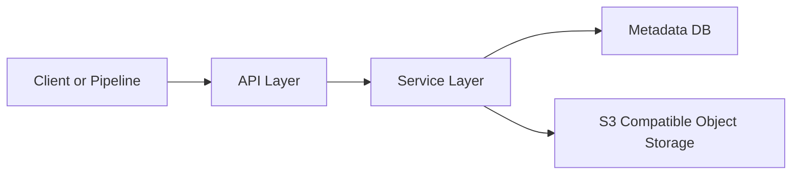

# Architecture

## Core Packages

- `db/core`: Storage interfaces and shared DB model contracts.
- `db/sqlite`, `db/postgres`: Database driver implementations.
- `internal/api`: API surfaces for DRS core and compatibility layers.
- `service`: Business logic for objects, access methods, service-info, and uploads.
- `urlmanager`: Signed URL generation and cloud storage interaction logic.
- `apigen`: Generated OpenAPI types and server interfaces.

For DB table relationships and schema details, see `db/README.md`.

## System View

