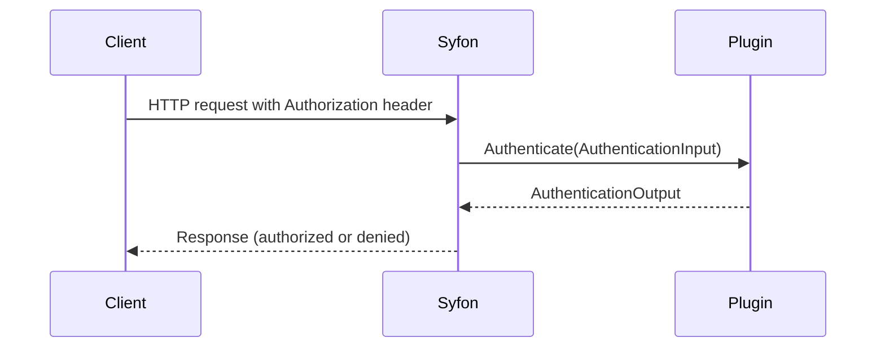

# Syfon Authentication Plugin Developer Guide

## Overview
Syfon supports external authentication plugins using the go-plugin architecture. Plugins are loaded at **server startup** (not build time) via the `SYFON_AUTHN_PLUGIN_PATH` environment variable. The main Syfon server process communicates with the plugin over RPC for every authentication request.

## Integration Timing
- **Integration occurs at server startup:** The plugin binary is loaded and registered when Syfon starts. No code changes or rebuilds of Syfon are required to add or update a plugin. The plugin must be present and executable at startup.

## Authoring a Plugin
Implement the following interface:

```go
type AuthenticationPlugin interface {
	Authenticate(ctx context.Context, in *AuthenticationInput) (*AuthenticationOutput, error)
}
```

- Input: `AuthenticationInput` contains the request ID, raw Authorization header, and request metadata.
- Output: `AuthenticationOutput` must set `Authenticated` true/false, and may set `Subject`, `Claims`, and `Reason`.

### Registration
Register your plugin with go-plugin under the key `"authn"`.

### Example Skeleton
```go
package main

import (
	"context"
	"github.com/hashicorp/go-plugin"
	"github.com/calypr/syfon/internal/api/middleware"
)

type MyAuthnPlugin struct{}

func (p *MyAuthnPlugin) Authenticate(ctx context.Context, in *middleware.AuthenticationInput) (*middleware.AuthenticationOutput, error) {
	// Your logic here
	return &middleware.AuthenticationOutput{Authenticated: true, Subject: "user"}, nil
}

func main() {
	plugin.Serve(&plugin.ServeConfig{
		HandshakeConfig: middleware.Handshake,
		Plugins: map[string]plugin.Plugin{
			"authn": &middleware.AuthnPluginRPC{},
		},
	})
}
```

## Sequence Diagram
Below is a high-level sequence diagram of the authentication flow:




## Testing
- Use Syfon's test suite or inject a dummy plugin manager for rapid iteration.
- Ensure your plugin binary is executable and compatible with Syfon's interface.

## Integration Checklist for Plugin Authors
1. Build your plugin as a standalone binary implementing the required interface.
2. Place the binary on the target system and set `SYFON_AUTHN_PLUGIN_PATH` to its path.
3. Restart Syfon. The plugin will be loaded at startup and used for all authentication requests.
4. No Syfon code changes or rebuilds are required for plugin integration.
