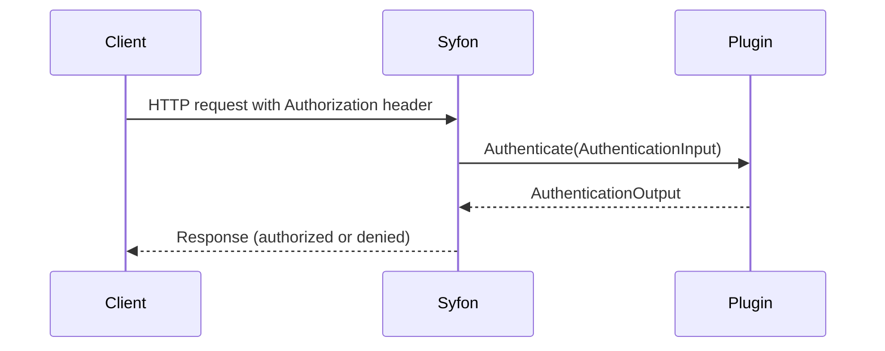

# Syfon Authentication Plugin Developer Guide

## Overview
Syfon supports external authentication plugins using the go-plugin architecture. Plugins are loaded at **server startup** (not build time) via the `SYFON_AUTHN_PLUGIN_PATH` environment variable. The main Syfon server process communicates with the plugin over RPC for every authentication request.

## Integration Timing
- **Integration occurs at server startup:** The plugin binary is loaded and registered when Syfon starts. No code changes or rebuilds of Syfon are required to add or update a plugin. The plugin must be present and executable at startup.

## Authoring a Plugin
Implement the following interface:

```go
package plugin

import "context"

type AuthenticationPlugin interface {
	Authenticate(ctx context.Context, in *AuthenticationInput) (*AuthenticationOutput, error)
}
```

- Input: `AuthenticationInput` contains the request ID, raw Authorization header, and request metadata.
- Output: `AuthenticationOutput` must set `Authenticated` true/false, and may set `Subject`, `Claims`, and `Reason`.

### Registration
Register your plugin with go-plugin under the key `"authn"`.

### Example Skeleton

The `Server` method returns an RPC adapter. The adapter exposes the `net/rpc` method signature. It forwards each call to the context-aware plugin implementation with `context.Background()`.

```go
package main

import (
	"context"
	"errors"
	"net/rpc"

	"github.com/calypr/syfon/plugin"
	hplugin "github.com/hashicorp/go-plugin"
)

type MyAuthnPlugin struct{}

func (p *MyAuthnPlugin) Authenticate(ctx context.Context, in *plugin.AuthenticationInput) (*plugin.AuthenticationOutput, error) {
	// Your logic here
	return &plugin.AuthenticationOutput{Authenticated: true, Subject: "user"}, nil
}

type authnRPCServer struct {
	impl *MyAuthnPlugin
}

func (s *authnRPCServer) Authenticate(in *plugin.AuthenticationInput, reply *plugin.AuthenticationOutput) error {
	if reply == nil {
		return errors.New("authentication RPC reply is nil")
	}
	if s.impl == nil {
		return errors.New("authentication plugin implementation is nil")
	}
	output, err := s.impl.Authenticate(context.Background(), in)
	if err != nil {
		return err
	}
	if output == nil {
		return errors.New("authentication plugin returned nil output")
	}
	*reply = *output
	return nil
}

type authnPluginRPC struct {
	hplugin.Plugin
	Impl *MyAuthnPlugin
}

func (p *authnPluginRPC) Server(*hplugin.MuxBroker) (interface{}, error) {
	return &authnRPCServer{impl: p.Impl}, nil
}

func (p *authnPluginRPC) Client(*hplugin.MuxBroker, *rpc.Client) (interface{}, error) {
	return nil, nil
}

func main() {
	hplugin.Serve(&hplugin.ServeConfig{
		HandshakeConfig: plugin.Handshake,
		Plugins: map[string]hplugin.Plugin{
			"authn": &authnPluginRPC{Impl: &MyAuthnPlugin{}},
		},
	})
}
```

## Sequence Diagram
Below is a high-level sequence diagram of the authentication flow:


```mermaid
sequenceDiagram
	participant Client
	participant Syfon
	participant Plugin
	Client->>Syfon: HTTP request with Authorization header
	Syfon->>Plugin: Authenticate(AuthenticationInput)
	Plugin-->>Syfon: AuthenticationOutput
	Syfon-->>Client: Response (authorized or denied)
```


## Testing
- Use Syfon's test suite or inject a dummy plugin manager for rapid iteration.
- Ensure your plugin binary is executable and compatible with Syfon's interface.

## Integration Checklist for Plugin Authors
1. Build your plugin as a standalone binary implementing the required interface.
2. Place the binary on the target system and set `SYFON_AUTHN_PLUGIN_PATH` to its path.
3. Restart Syfon. The plugin will be loaded at startup and used for all authentication requests.
4. No Syfon code changes or rebuilds are required for plugin integration.
