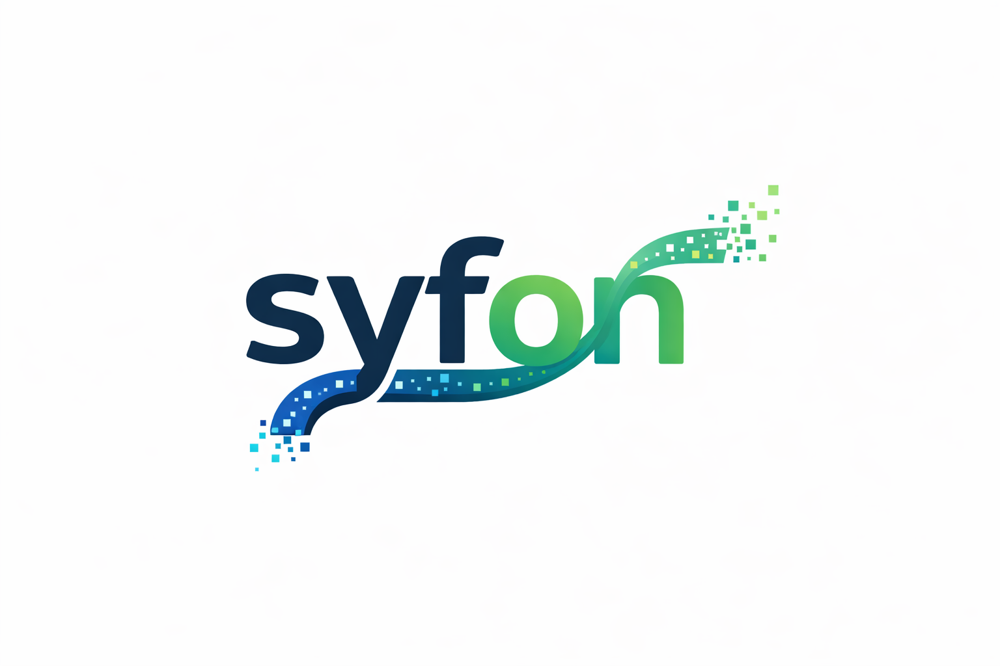
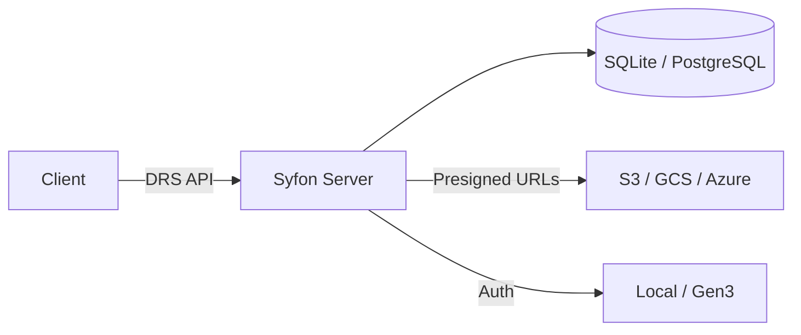

# Syfon

<p align="center">
  
</p>

A lightweight, production-grade implementation of a [GA4GH Data Repository Service (DRS)](https://ga4gh.github.io/data-repository-service-schemas/) server in Go.

## Overview

Syfon manages metadata for large data objects and provides secure, cloud-agnostic access via presigned URLs. It is designed for research data platforms that need reliable, auditable data transfer at scale.



## Key Features

- **GA4GH DRS compliance** — implements the standard DRS API for describing and accessing data objects, including bulk registration, retrieval, and access-method management
- **Multi-cloud storage** — native support for S3 (and S3-compatible endpoints like MinIO, RGW, and RustFS), GCS, and Azure Blob via presigned URL generation
- **Multipart upload and download** — explicit `init → part → complete` lifecycle with resumable semantics for very large files
- **Flexible auth** — `local` mode for development (optional HTTP basic auth), `gen3` mode for production Gen3/Fence/Arborist integration
- **Database flexibility** — SQLite for local/dev, PostgreSQL for production
- **Credential encryption at rest** — envelope encryption (AES-GCM) with a local server-side KEK

## Useful Endpoints

| Endpoint | Description |
|---|---|
| `GET /healthz` | Health check |
| `GET /service-info` | DRS service info |
| `GET /index/swagger` | Swagger UI |
| `GET /index/openapi.yaml` | OpenAPI spec |
| `GET /ga4gh/drs/v1/objects/{id}` | Fetch DRS object |
| `POST /ga4gh/drs/v1/objects/register` | Bulk register objects |
| `POST /data/upload` | Request presigned upload URL |
| `POST /data/multipart/init` | Initiate multipart upload |
| `POST /index/bulk/sha256/validity` | Bulk SHA256 validity check |

## Project Layout

```
syfon/
├── apigen/         # Generated OpenAPI models (separate Go module)
├── client/         # Go client SDK (separate Go module)
├── cmd/            # CLI commands (serve, upload, download, version, ...)
├── config/         # Config loading and validation
├── db/             # Database interfaces, SQLite and PostgreSQL drivers
├── internal/api/   # HTTP route handlers (DRS, internal, LFS, metrics)
├── service/        # High-level DRS business logic
├── urlmanager/     # Cloud storage signing and multipart logic
└── version/        # Build and version info
```

## Next Steps

- [Quick Start](quickstart.md) — first local run and smoke test
- [Local Deployment](local-deployment.md) — SQLite plus `auth.mode: local` for development
- [Kubernetes Deployment](kubernetes-deployment.md) — Helm-chart deployment with Gen3 and PostgreSQL
- [Server Configuration](configuration.md) — raw Syfon config schema and field reference
- [Encryption](encryption.md) — credential encryption at rest
- [Troubleshooting](troubleshooting.md) — common issues and fixes
