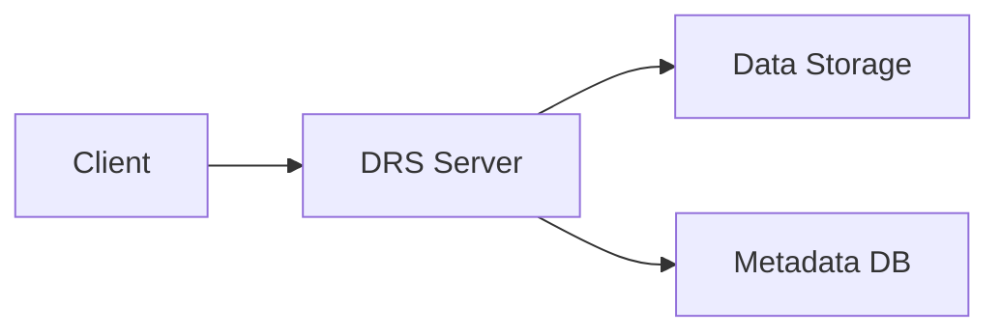

# drs-server

A lightweight reference implementation of a GA4GH Data Repository Service (DRS) server in Go.

See the `README.md` in the repository root for more details.

## Overview

- Implements GA4GH DRS endpoints using Go.
- Uses the official GA4GH DRS OpenAPI spec via a Git submodule at `ga4gh/data-repository-service-schemas`.
- Generates server stubs into `internal/apigen`.

## Architecture



## Quick Start ⚡️

!!! warning
    Add steps that actually interact with the **DRS Server**:

    - [ ] Listing
    - [ ] Registering
    - [ ] Retrieving/Resolving DRS URI's → files

```sh
# TODO: Change to latest tag when stable
# docker run -p 8080:8080 ghcr.io/calypr/drs-server:latest

➜ docker run -p 8080:8080 ghcr.io/calypr/drs-server:feature-actions
{
  "level": "info",
  "caller": "server/main.go:123",
  "msg": "listening",
  "addr": ":8080"
}

➜ curl localhost:8080/healthz
{
  "status": "ok"
}
```
