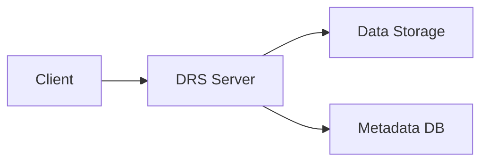

# syfon

A lightweight reference implementation of a GA4GH Data Repository Service (DRS) server in Go.

See the `README.md` in the repository root for more details.

## Overview

- Implements GA4GH DRS endpoints using Go.
- Uses the official GA4GH DRS OpenAPI spec via a Git submodule at `ga4gh/data-repository-service-schemas`.
- Generates server stubs into `internal/apigen`.

## Architecture

