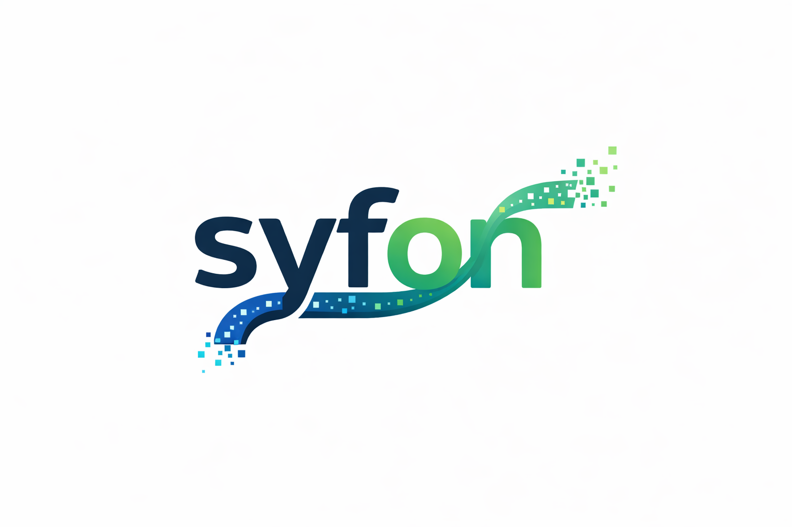
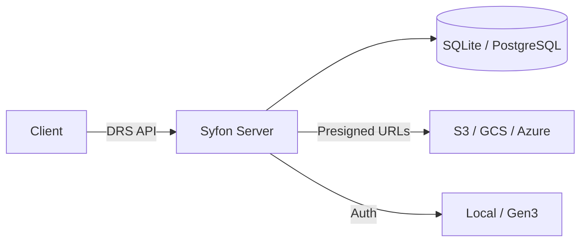

# Syfon

<p align="center">
  
</p>

A lightweight, production-grade implementation of a [GA4GH Data Repository Service (DRS)](https://ga4gh.github.io/data-repository-service-schemas/) server in Go.

## Overview

Syfon manages metadata for large data objects and provides secure, cloud-agnostic access via presigned URLs. It is designed for research data platforms that need reliable, auditable data transfer at scale.


```mermaid
graph LR
    A[Client] -->|DRS API| B[Syfon Server]
    B --> C[(SQLite / PostgreSQL)]
    B -->|Presigned URLs| D[S3 / GCS / Azure]
    B -->|Auth| E[Local / Gen3]
```

## Key Features

- **GA4GH DRS compliance** — implements the standard DRS API for describing and accessing data objects, including bulk registration, retrieval, and access-method management
- **Multi-cloud storage** — native support for S3 (and S3-compatible endpoints like MinIO, RGW, and RustFS), GCS, and Azure Blob via presigned URL generation
- **Multipart upload and download** — explicit `init → part → complete` lifecycle with resumable semantics for very large files
- **Flexible auth** — `local` mode for development (optional HTTP basic auth), `gen3` mode for production Gen3/Fence/Arborist integration
- **Database flexibility** — SQLite for local/dev, PostgreSQL for production
- **Credential encryption at rest** — envelope encryption (AES-GCM) with a local server-side KEK

## Useful Endpoints

| Endpoint | Description |
|---|---|
| `GET /healthz` | Health check |
| `GET /service-info` | DRS service info |
| `GET /index/swagger` | Swagger UI |
| `GET /index/openapi.yaml` | OpenAPI spec |
| `GET /ga4gh/drs/v1/objects/{id}` | Fetch DRS object |
| `POST /ga4gh/drs/v1/objects/register` | Bulk register objects |
| `POST /data/upload` | Request presigned upload URL |
| `POST /data/multipart/init` | Initiate multipart upload |
| `POST /index/bulk/sha256/validity` | Bulk SHA256 validity check |

## Project Layout

```
syfon/
├── apigen/         # Generated OpenAPI models (separate Go module)
├── client/         # Go client SDK (separate Go module)
├── cmd/            # CLI commands (serve, upload, download, version, ...)
├── internal/httpapi/ # HTTP routes, handlers, middleware, and protocol adapters
├── internal/objects/ # Catalog queries, mutations, and canonical content
├── internal/buckets/ # Bucket credentials, scopes, visibility, and cache policy
├── internal/storage/ # Provider-neutral storage and provider adapters
├── internal/transfers/ # Access issuance, upload workflows, and multipart sessions
├── internal/usage/ # Event writer contracts and scoped accounting reports
├── internal/maintenance/projectstorage/ # Storage inspection and project cleanup
├── internal/maintenance/scoperepair/ # Catalog reference audit and repair
├── internal/requestid/ # Request correlation through context
├── internal/faults/ # Shared error classifications
├── internal/persistence/ # SQLite and PostgreSQL adapters
├── internal/access/ # Authorization policy and authentication integrations
├── internal/credentialcipher/ # Credential encryption
├── internal/config/ # Config loading and validation
└── internal/version/ # Build and version info
```

## Next Steps

- [Quick Start](quickstart.md) — first local run and smoke test
- [Local Deployment](local-deployment.md) — SQLite plus `auth.mode: local` for development
- [Kubernetes Deployment](kubernetes-deployment.md) — Helm-chart deployment with Gen3 and PostgreSQL
- [Server Configuration](configuration.md) — raw Syfon config schema and field reference
- [Encryption](encryption.md) — credential encryption at rest
- [Troubleshooting](troubleshooting.md) — common issues and fixes
